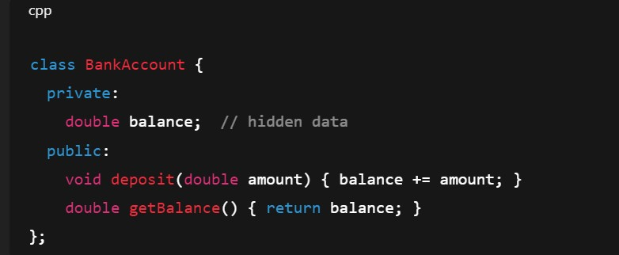

# Introduction to OOP Basic Features

## **o	Introduction to OOP:**
### **•  Definition:**

Object-Oriented Programming (OOP) is a programming paradigm based on the concept of objects, which contain data (attributes) and methods (functions) that operate on the data. 

•  Instead of focusing only on functions and logic (like in C), OOP focuses on data + behavior together.

•  In C++, classes are used to create objects, and these objects interact to form programs.

### **Basic Features of OOP.**
OOP is based on the following four key principles:

1.	Encapsulation
2.	Abstraction
3.	Inheritance
4.	Polymorphism

### **1. Encapsulation (Data Hiding & Binding)**

Encapsulation is the concept of hiding data and restricting direct access to it. Data is kept private and can only be accessed using public methods (getters and setters).

Helps in data security by using access specifiers:

•	private → accessible only inside the class

•	protected → accessible in class & derived classes

•	public → accessible anywhere

👉 Example:

🔹 Advantages:

•	Protects data from accidental modification.
  
  •	Maintains data integrity and security.
  
  •	Increases code maintainability.
  
  
### **2. Abstraction (Showing Essential Details, Hiding Complexity)**

Abstraction is the process of hiding unnecessary details from the user and only exposing the essential features of an object.

👉 Example:
